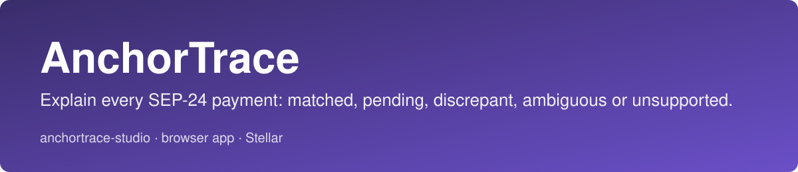
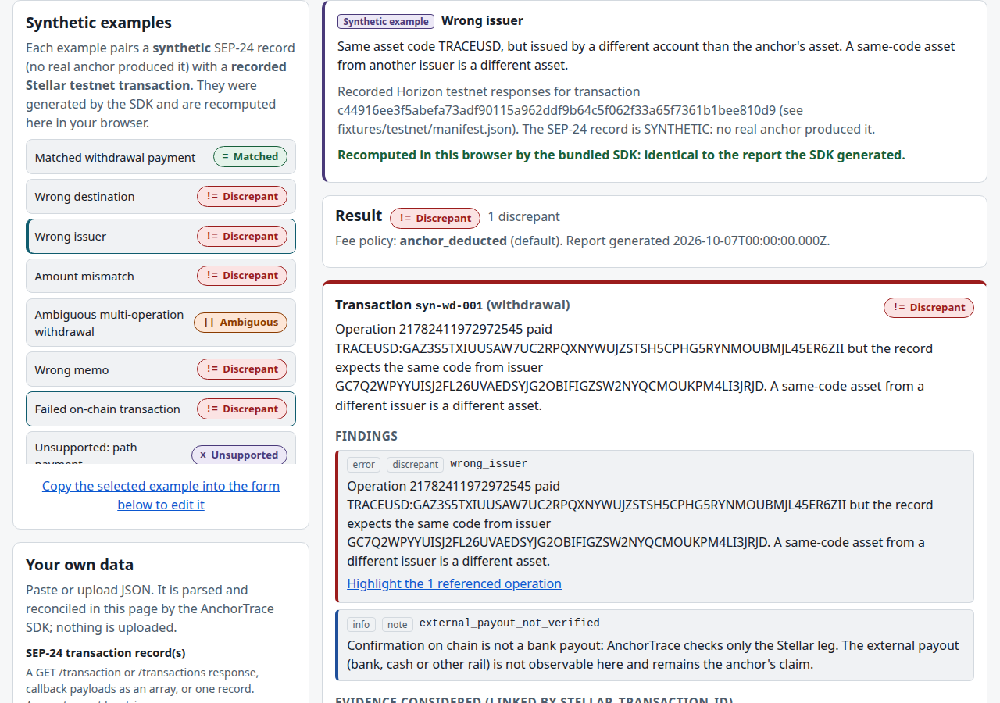

<p align="center"></p>

# anchortrace-studio

[](https://github.com/Anchor-Trace/anchortrace-studio/actions/workflows/ci.yml) [](LICENSE) [](https://github.com/Anchor-Trace/anchortrace-studio/releases)

[Documentation](https://stellar-developer-tools.gitbook.io/anchortrace-studio/) · [Live demo](https://anchortrace-studio-anasamasama.vercel.app) · [Core repository](https://github.com/Anchor-Trace/anchortrace-sdk) · [Issues](https://github.com/Anchor-Trace/anchortrace-studio/issues) · [Discussions](https://github.com/Anchor-Trace/anchortrace-studio/discussions)


Hosted demo: https://anchortrace-studio-anasamasama.vercel.app

Investigate an anchor payment in your browser. Paste a SEP-24 transaction record and the Stellar evidence; see why they agree or not, with the conflicting operations highlighted. Nothing leaves the page.

> **Confirmation on chain is not a bank payout.** For a withdrawal, a matching Stellar payment shows only the wallet-side transfer. The anchor's bank or cash payout cannot be observed here, and every result says so.

This is the browser front end of [anchortrace-sdk](https://github.com/Anchor-Trace/anchortrace-sdk). It contains no reconciliation logic of its own: it bundles a pinned build of the SDK and displays the SDK's report.



Screenshots in `docs/evidence/screenshots/` were taken from the production build with Playwright (`01` is the empty state).

## What you can do
- Pick one of 18 **synthetic examples** (a made-up SEP-24 record around a recorded Stellar testnet transaction): matched, wrong destination, wrong issuer, wrong amount, ambiguous multi-operation, path payment, claimable balance, Soroban transfer, pending, missing evidence, reordered and duplicate status updates, and more. The browser re-runs the SDK on the example and checks the result equals the report the SDK generated.
- Paste or upload your own record and Horizon evidence (an AnchorTrace evidence file, or a raw `{ "transaction": ..., "operations": ... }` pair taken from `/transactions/<hash>` and `/transactions/<hash>/operations`), choose the fee policy and other verdict options, and press Reconcile.
- Read the status timeline, the findings, what the record implies on chain, and each operation considered with an expected-versus-observed table. A finding's button highlights the operations it names.
- Open a report saved by the SDK's CLI.
- Download a **redacted** report (accounts, memos, emails by default; issuers and hashes optional) as JSON or Markdown.

Outcomes: `matched`, `pending`, `discrepant`, `ambiguous`, `unsupported`, `insufficient_evidence` (definitions in the SDK's README and SPEC).

## Run
Not hosted anywhere. Node 22 or newer, pnpm 11:

```bash
git clone <this repo> && cd anchortrace-studio
pnpm install --frozen-lockfile
pnpm dev                      # development server
pnpm build && pnpm preview    # production build with the no-network CSP, http://127.0.0.1:4173
```

Tests:

```bash
pnpm test                     # Vitest: state, SDK pairing, input handling, examples reproduce the SDK reports
pnpm test:e2e                 # build, then Playwright in a real Chromium against the production build
PW_CHANNEL=chrome pnpm test:e2e   # same, using an installed Google Chrome instead of Playwright's Chromium
```

The first `pnpm test:e2e` needs a browser: `pnpm exec playwright install chromium`, or set `PW_CHANNEL=chrome`.

## SDK pairing
| Studio | SDK | Report / evidence / case schema | Pinned artifact |
|---|---|---|---|
| 0.1.1 | `@anas.abubakar/anchortrace-sdk` 0.1.1, git tag `v0.1.1`, commit `e480415795b907f2cc9408febc98b957bc537c43` | 1 / 1 / 1 | `vendor/anas.abubakar-anchortrace-sdk-0.1.1.tgz` (SHA-256 `ebe3b7702cfb51bbfc63a0521deb4783d0795a077e6704a6688f7d0912c418e4`) |

`pairing.json` is the source of truth. `pnpm run check:pairing` (run by `pnpm build` and CI) fails if the tarball, the installed SDK or the vendored schemas in `vendor/schema/` drift. At run time the page compares the bundled SDK's versions with the pairing and refuses to show results if they differ. There are no sibling-path imports: the repository builds from a clean clone.

## Privacy and what is enforced
- The production page ships `Content-Security-Policy: ... connect-src 'none' ...`, so the browser itself blocks any connection from the page; a Playwright test asserts that fetches to Horizon and to the page's own origin are blocked and that every request stays on the origin.
- No storage: no cookies, localStorage, IndexedDB or analytics.
- Downloads are generated locally from the report.
- Redaction is the SDK's: values become stable aliases over sorted distinct values; secret keys are always removed; free text in a record's `message` is only scanned for addresses, emails and known memos. Review exports before sharing.

## How it was verified
Run on 2026-10-07: Vitest 20 tests; Playwright 58 tests against the production build, passing both in Playwright's Chromium (headless shell 153, the path CI uses) and in an installed Google Chrome 154. They include axe-core accessibility scans (light and dark), keyboard operation, the CSP check, all 18 examples, redaction downloads, the 5 MB limit and no horizontal scrolling at 375, 768 and 1440 px. Transcripts: `docs/evidence/vitest.txt`, `docs/evidence/e2e-playwright-chromium.txt`, `docs/evidence/e2e-google-chrome-154.txt`, `docs/evidence/check-pairing.txt`.

## Limitations
- Version one covers SEP-24 and classic direct payments only; path payments, claimable balances and Soroban transfers are reported as `unsupported`.
- The studio cannot fetch evidence. Use Horizon (or the SDK CLI's `--horizon`) to get the JSON.
- Example SEP-24 records are synthetic. No anchor, wallet or support team has used or validated this tool.
- Verification used Chromium-based engines only (Chromium 153 and Chrome 154, Linux). Other browsers, screen readers and real phones were not tested; axe-core finds only a subset of accessibility problems.
- The loading state is exercised in the state-machine unit test; in the browser the SDK call is fast enough that it is rarely visible.
- Large inputs are processed on the main thread (5 MB cap).
- Live on Vercel; not published to npm (it is an app).

## Repository layout

- `docs/`: decision records (ADRs), evidence and assets
- `e2e/`: Playwright browser tests
- `gitbook/`: source of the GitBook documentation
- `scripts/`: build, generation and recording scripts
- `src/`: source
- `test/`: tests
- `vendor/`: pinned artifacts from the paired core repository

## Documentation

The full documentation is at https://stellar-developer-tools.gitbook.io/anchortrace-studio/. It is built from the `gitbook/` folder of this repository and synced from `main`, so a fix to a page is a pull request here.

## Contributing

Open issues are scoped so one person can finish one in a single cycle, and each lists acceptance criteria. Read [CONTRIBUTING.md](CONTRIBUTING.md), pick an issue from the [issue list](https://github.com/Anchor-Trace/anchortrace-studio/issues), and say you are taking it before you start. Security reports go through [SECURITY.md](SECURITY.md), not public issues.

## Maintainers

| Maintainer | Role | GitHub |
|---|---|---|
| Anas Abubakar | Lead maintainer | [@Anasabubakar](https://github.com/Anasabubakar) |
| Abdulbasit Fazazi | Co-maintainer | [@fazaziishola-coder](https://github.com/fazaziishola-coder) |

## Community

Questions and design discussion go in [GitHub Discussions](https://github.com/Anchor-Trace/anchortrace-studio/discussions). Bugs and scoped work go in [Issues](https://github.com/Anchor-Trace/anchortrace-studio/issues).

## License

MIT. See [LICENSE](LICENSE).

## Contributors

Thanks to all the contributors who have made this project possible.

<a href="https://github.com/Anchor-Trace/anchortrace-studio/graphs/contributors">
  
</a>
